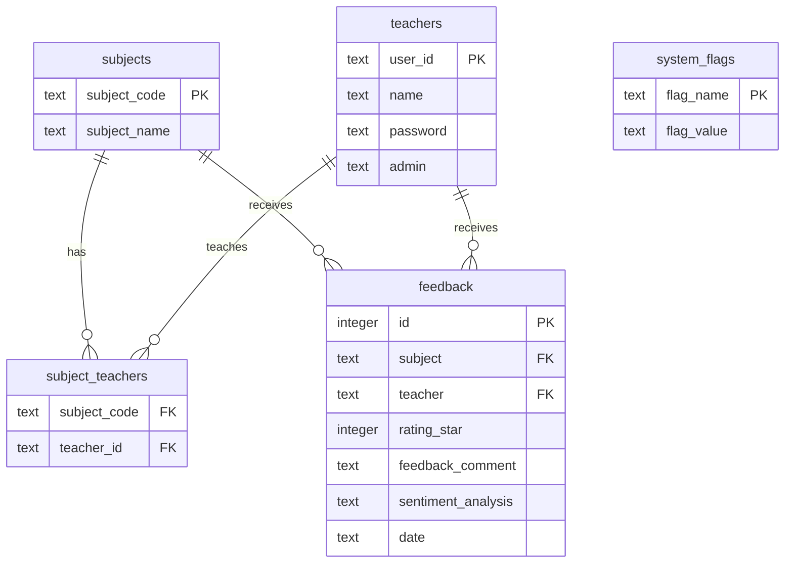

# Student Feedback Review System 🎓💬

An AI-powered, modern, and anonymous student feedback platform designed for educational institutions. This system allows students to submit ratings and review comments for their courses and instructors in under a minute, completely anonymously. The backend is built with Python and Flask, utilizing TextBlob for real-time sentiment analysis, while the frontend offers a responsive, polished, and premium SaaS-style interface.

---

## 🌟 Key Features

### 1. For Students
*   **100% Anonymous Feedback:** No registration or login required. Students can voice their honest opinions without fear of backlash.
*   **Dynamic Dropdowns:** Selecting a subject automatically loads the corresponding assigned instructors in real-time via AJAX/Fetch API.
*   **Premium Interactive Star Rating:** Smooth hover effects, scaling animations, and clear labels (Poor, Fair, Average, Good, Excellent) to represent ratings.
*   **Review Character Limits:** Textarea with a dynamic, color-changing character counter (limit 300 characters) to keep reviews concise and readable.

### 2. AI Sentiment Analysis Engine
*   **TextBlob NLP Integration:** Automatically analyzes student review text upon submission to classify it as **positive**, **neutral**, or **negative**.
*   **Robust Classification Rules:**
    *   `polarity > 0.1` ➡️ **Positive**
    *   `polarity < -0.1` ➡️ **Negative**
    *   Otherwise ➡️ **Neutral**
*   **Error-Resilient:** Falls back gracefully to neutral on blank comments or exceptions.

### 3. For Teachers (My Insights Portal)
*   **Personal Dashboard:** Detailed visual analytics tailored specifically to the logged-in teacher.
*   **Aggregate Analytics:** Total feedbacks received and average star rating.
*   **Visual Sentiment Distribution:** Pie charts or statistics indicating Positive, Neutral, and Negative sentiments.
*   **Rating Distribution:** Bar charts representing the frequency of ratings (1 to 5 stars).
*   **Recent Feedbacks:** Access logs of individual feedback statements, comments, dates, ratings, and AI sentiments.

### 4. For Administrators (Control Panel)
*   **Global Overview Dashboard:** Overall statistics across all subjects, teachers, and feedbacks.
*   **Feedback Management:** View all feedback entries in detail, search/filter by teacher, subject, or rating, and delete inappropriate feedback.
*   **Subject Management (CRUD):** Add new subjects (automatically formats subject codes like `AL 601`), assign multiple teachers to a subject, or delete subjects.
*   **Teacher Management (CRUD):** Register teachers (automatically formats IDs, generates default password `123456`), assign subjects, promote to Admin, or delete accounts.
*   **Super-Admin Control (ADM001):** The primary administrator can create new custom admin accounts, promote existing teachers, or demote/remove custom admin privileges.

### 5. UI/UX & Security Highlights
*   **SaaS-Style Desktop Sidebar:** Expandable/collapsible sidebar menu with localStorage memory state preservation.
*   **Page-load & Reveal Animations:** Subtle fading transitions (Intersection Observer) making the UI feel responsive and alive.
*   **Input Formatting Rules (JS-enforced):**
    *   **User IDs / Teacher IDs:** Auto-formats on type to exactly 3 uppercase letters followed by 3 digits (e.g., `ADM001`, `TCH001`).
    *   **Subject Codes:** Auto-formats on type to 2 uppercase letters, a space, and 3-4 digits (e.g., `AL 601`).
*   **Cache Control Headers:** Prevents users from accessing cached dashboards via the browser's "Back" button after logging out.

---

## 🛠️ Technology Stack

| Layer | Technology | Purpose |
| :--- | :--- | :--- |
| **Frontend** | HTML5, CSS3, Vanilla JavaScript | Structure, styling, and client-side interactions |
| **Framework** | Bootstrap 5.3 & custom styling | Responsive layouts, grid system, modal overlays |
| **Icons** | Font Awesome 6.5.1, Bootstrap Icons, Flaticon UIcons, Lucide Icons | Premium graphics and interface elements |
| **Backend** | Python 3.x, Flask 3.1.1 | Application framework, routing, and controllers |
| **Database** | SQLite3 | Local, file-based relational database |
| **AI/NLP** | TextBlob | Sentiment classification and polarity computation |

---

## 📁 Project Structure

```text
Student Feedback Review System/
│
├── app.py                      # Main entrypoint of the application; initializes app, blueprints, & registers error-handlers
├── database.py                 # SQLite configuration, connection handlers, schema declaration, and auto-seeding
├── requirements.txt            # Python dependencies (Flask, Werkzeug, textblob)
├── feedback_system.db          # Auto-generated SQLite Database file
│
├── routes/                     # Blueprint controllers separating route logic
│   ├── admin.py                # Admin controls, authentication logic, CRUD routes, and dashboard APIs
│   ├── feedback.py             # Feedback submission form GET/POST & teacher AJAX fetching API
│   └── main.py                 # Landing page route
│
├── utils/                      # Helper libraries
│   └── sentiment.py            # AI Sentiment analyzer wrapping TextBlob functions
│
├── static/                     # Static assets
│   ├── css/
│   │   └── style.css           # Premium styles, CSS variables, SaaS components, transitions, and media queries
│   └── js/
│       └── script.js           # Client validations, user ID formatting, modals, observers, and scroll effects
│
└── templates/                  # Jinja2 HTML templates
    ├── 404.html                # Custom Page Not Found page
    ├── 500.html                # Custom Internal Server Error page
    ├── base.html               # Main layout wrapper containing Navbar, Footer, and Modals
    ├── index.html              # Modern animated landing page
    ├── feedback.html           # Student Feedback submission page
    │
    ├── admin/                  # Administrator views
    │   ├── base.html           # Admin sidebar/header layout with localStorage drawer collapsing logic
    │   ├── dashboard.html      # Overview analytics, charts (ratings, teachers, sentiment)
    │   ├── feedbacks.html      # Filterable list of all feedback submissions with delete option
    │   ├── teachers.html       # Teacher registry table, adding/deleting teachers, toggle admin privilege
    │   ├── subjects.html       # Subject listing table, adding/deleting subjects, mapping multiple teachers
    │   ├── admins.html         # Super-admin portal to manage custom admins (restricted to ADM001)
    │   └── profile.html        # Admin user profile and stats summary
    │
    └── teacher/                # Teacher views
        ├── dashboard.html      # Personal insights analytics, star distributions, sentiment chart logs
        └── feedbacks.html      # Filtered feedbacks list for courses taught by the teacher
```

---

## 📊 Database Schema Design

The SQLite relational database consists of 5 main tables:



1.  **`subjects`**: Stores subject-specific unique codes (e.g., `AL 601`) and full names.
2.  **`teachers`**: Stores teacher profiles, login passwords, and roles (`admin='yes'` / `'no'`).
3.  **`subject_teachers`**: Many-to-many bridge table mapping which instructor(s) can teach which subject(s). Extends delete operations using `ON DELETE CASCADE`.
4.  **`feedback`**: Stores individual feedback entries. Integrates foreign key constraints to both `subjects` and `teachers`.
5.  **`system_flags`**: Simple key-value store to track system preferences (e.g., `db_seeded = 'yes'` to prevent multiple database seeding on restarts).

---

## 🚀 Getting Started

Follow these steps to set up and run the project locally on your machine:

### 1. Prerequisites
Ensure you have **Python 3.8+** installed on your system.

### 2. Installation Steps
1.  **Clone / Download the project files** into a workspace folder:
    ```bash
    cd "Student Feedback Review System"
    ```

2.  **Create and activate a virtual environment** (highly recommended):
    *   **Windows (PowerShell):**
        ```powershell
        python -m venv venv
        .\venv\Scripts\Activate.ps1
        ```
    *   **Mac/Linux:**
        ```bash
        python3 -m venv venv
        source venv/bin/activate
        ```

3.  **Install dependencies:**
    ```bash
    pip install -r requirements.txt
    ```

4.  **Launch the application:**
    ```bash
    python app.py
    ```
    The console will display:
    ```text
    * Running on http://127.0.0.1:5000 (Press CTRL+C to quit)
    ```

5.  **Access the application:**
    Open your browser and navigate to `http://127.0.0.1:5000`

---

## 🔑 Default Seeded Credentials

When the app is started for the first time, the database `feedback_system.db` is initialized and pre-seeded automatically with the following accounts:

### 1. Administrator Account (Super Admin)
*   **User ID:** `ADM001`
*   **Password:** `123456`
*   **Access:** Full Admin Portal, CRUD operations on Subjects & Teachers, Admin privileges control.

### 2. Teacher Accounts (Pre-Seeded)
You can login to any of these accounts to view the **Teacher Dashboard (Insights & Feedbacks)**:

| User ID | Password | Teacher Name | Assigned Subjects |
| :--- | :--- | :--- | :--- |
| `TCH001` | `123456` | Mr. Manoj Kumar | AL 601 (Theory of Computation), AL 602, AL 603 |
| `TCH002` | `123456` | Mr. Nitesh Gupta | AL 602 (Computer Networks) |
| `TCH003` | `123456` | Neelam Bisen | AL 603 (Data and Visual Analytics) |
| `TCH004` | `123456` | Pranjali Pachpor | AL 604 (Cloud Computing) |

*Note: You can update the passwords for any of these accounts via the Profile section inside their dashboards.*

---

## 🗺️ Route Mappings & API Endpoints

### Public Routes
*   `GET /` - Animated Landing page ([index.html](file:///d:/Feedback%20Review%20System%20Project%20Final/Student%20Feedback%20Review%20System/templates/index.html))
*   `GET /feedback` - Student feedback submission form page ([feedback.html](file:///d:/Feedback%20Review%20System%20Project%20Final/Student%20Feedback%20Review%20System/templates/feedback.html))
*   `POST /feedback` - Receives feedback inputs, triggers TextBlob sentiment classification, and commits to SQLite. Supports Ajax response formats.
*   `GET /get-teachers/<subject_id>` - API endpoint queried via AJAX. Resolves and returns instructor mappings for the selected subject dropdown dynamically.

### Authenticated & Shared Routes
*   `POST /admin/login` - Secure credentials verify endpoint. Establishes session state and returns target dashboard redirects.
*   `GET /admin/logout` - Terminates the user session and redirects to the landing page.
*   `GET /admin/profile` - Displays the profile information of the current user, along with teacher analytics if applicable.
*   `POST /admin/change-password` - Processes password updates (verifies current password, checks new password meets the 6-character minimum, and updates database).

### Teacher Routes (Auth Required)
*   `GET /admin/teacher/dashboard` - Dashboard containing teacher-specific feedback lists, average rating, star breakdown metrics, and sentiment polarity count summary.
*   `GET /admin/teacher/feedbacks` - Feedback manager for instructors, supporting search/filter by subject and rating values.

### Admin Routes (Admin Role Required)
*   `GET /admin/dashboard` - Global metrics dashboard, including global rating trends, sentiment percentages, teacher averages, and global feedback feeds.
*   `GET /admin/feedbacks` - Listing of all system feedbacks, supporting filtering by subject, teacher name, or rating.
*   `POST /admin/delete/<feedback_id>` - Deletes a specific feedback entry.
*   `GET /admin/teachers` - Teacher Management Panel. Shows subject allocations, average rating, and feedback counts.
*   `POST /admin/teachers/add` - Adds a new teacher registry.
*   `POST /admin/teachers/delete/<teacher_id>` - Deletes a teacher and cascades feedback/subject assignments.
*   `POST /admin/teachers/toggle-admin/<teacher_id>` - Promotes or demotes an instructor (Admin control).
*   `GET /admin/subjects` - Subject Management Panel. Displays teacher-subject maps and feedback counts.
*   `POST /admin/subjects/add` - Adds a new subject to the database.
*   `POST /admin/subjects/update_teacher/<subject_id>` - Reallocates multiple instructors to a course.
*   `POST /admin/subjects/delete/<subject_id>` - Deletes a subject code.
*   `GET /admin/admins` - Super-admin custom administrator configuration table (restricted to `ADM001`).
*   `POST /admin/admins/add` - Generates new admin registries.
*   `POST /admin/admins/promote` - Promotes regular teachers to Admin status.
*   `POST /admin/admins/delete/<admin_id>` - Removes or demotes custom admins.
